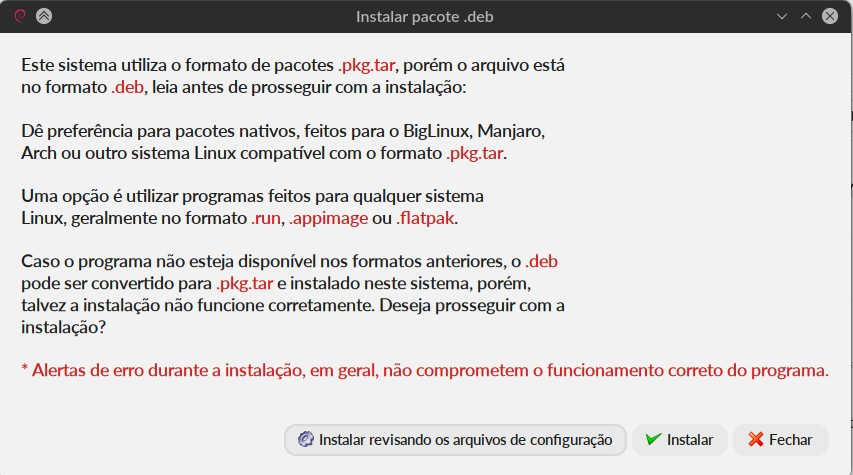

This is a fork with modifications to turn more simple and add gui, the original project is: https://github.com/helixarch/debtap
======

# English

After many years of using .deb over the past few months I am adapting to .pkg.tar packages.

debtap does a good job, but I was looking for something more automated and just 2 clicks on a .deb, so I made some changes, in the way of running the post installation scripts and also in the way of detecting the package's dependencies, using now the namcap.

I also made an interface in Yad so that the interaction is simpler and soon after generating the package, it is installed through the Pamac interface.

So here we have a really simple and functional way to install .deb files on systems using the Pamac package manager.

The tests were performed using Banco do Brasil's .deb warsaw, Caixa Econômica do Brasil, PJE-Office and Bricscad. All are installing correctly.

The converter will not always be able to install in a way that the program works correctly, but the level of success is higher than I expected to achieve.

# Português

Após muitos anos utilizando .deb nos últimos meses estou me adaptando aos pacotes .pkg.tar.

O debtap faz um bom trabalho, mas eu procurava algo mais automatizado e que bastasse dar 2 cliques em um .deb, então fiz algumas modificações, na forma de executar os scripts de pós instalação e também na forma de detectar as dependências do pacote, utilizando agora o namcap.

Fiz também uma interface em Yad para que a interação seja mais simples e logo após gerar o pacote o mesmo é instalado através da interface do Pamac.

Então aqui temos uma forma realmente simples e funcional para instalar arquivos .deb em sistemas que utilizam o gerenciador de pacotes Pamac.

Os testes foram feitos utilizando o .deb warsaw do Banco do Brasil, Caixa Econômica do Brasil, PJE-Office e o Bricscad. Todos estão instalando corretamente.

O conversor nem sempre irá conseguir instalar de forma que o programa funcione corretamente, mas o nível de acerto está maior do que eu esperava conseguir.

